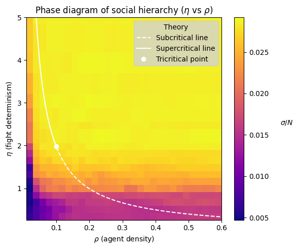
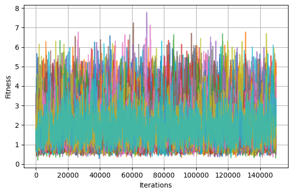
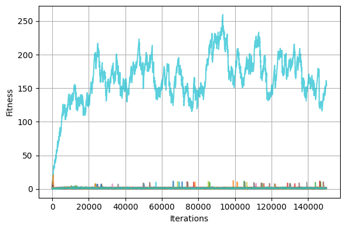
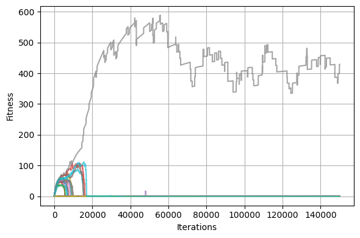
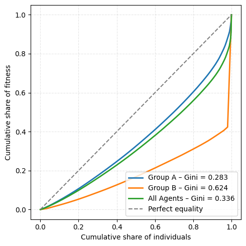

# 🧠 Emergence of Social Hierarchies

How can structured inequalities arise from initially equal societies?  
This project explores that question through **agent-based simulations** inspired by:

- 🐝 The **Bonabeau model** (1995) — hierarchy from local competition and memory decay  
- ⚖️ The **Sadurní model** (2024) — two-group rivalry with normalized prestige  

We replicate, analyze, and **extend** these models with two original contributions:
1. Unequal importance of winning depending on the group  
2. Internal (intra-group) competition dynamics

---

## 🔍 Models at a Glance

- **Bonabeau**: agents gain/lose fitness in fights; hierarchy emerges when density is high enough  
- **Sadurní**: fitness is exchanged between two groups only; total fitness is conserved  
- **Our extensions**: add asymmetric exchange rules and intra-group competition

---

## 📊 Key Results

### 1. 📈 Phase transition in Bonabeau's model  
Hierarchy emerges when density crosses a critical threshold  

---

### 2. 👑 Determinism (η) controls hierarchy  
Low η → no structure; High η → clear dominance  
<table>
  <tr>
    <th>η = 1 (Low determinism) ➡️ No structure, random dynamics</th>
    <th>η = 5 (Moderate determinism) ➡️ One dominant leader emerges</th>
    <th>η = 10 (High determinism) ➡️ Temporary multi-leadership, then stability</th>
  </tr>
  <tr>
    <td></td>
    <td></td>
    <td></td>
  </tr>
</table>

---

### 3. ⚖️ Small group sizes increase vulnerability to hierarchy  
Minority groups tend to develop stronger inequality (higher Gini coefficients)  

---

### 4. ⚙️ Asymmetry in victory impact leads to unstable leadership  
When the fitness exchanged depends on the winner’s group:  
- If one group loses significantly more in case of defeat, its internal dynamics become unstable.  
- In this group, leaders emerge quickly but are replaced just as fast, producing **short-lived hierarchies**.  
This models fragile societies, where power is volatile and leadership is constantly shifting.

---

### 5. 🔄 Intra-group competition changes how hierarchies form  
Adding intra-group interactions introduces new dynamics:  
- When **inter-group** competition dominates, hierarchy forms through repeated external victories.  
- When **intra-group** rivalry dominates, strong internal stratification appears early and persists.  
This mechanism alters **how** hierarchies form, even if the overall inequality remains similar.

---
